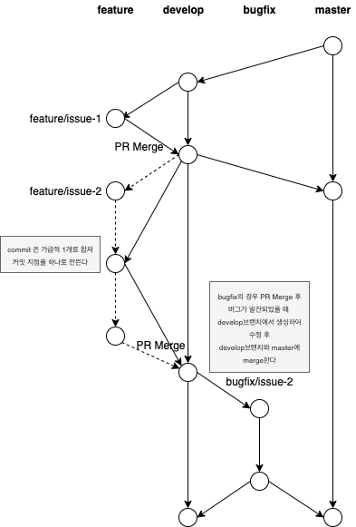

# Git Branch Strategy
## 협업을 위한 깃 브랜치 규칙


### branch 종류
- master: 최종 릴리즈된 소스
    - develop 브랜치에서 merge하여 릴리즈 하였을 때 릴리즈 태그 생성
- develop: 개발 완료된 소스
    - 개발이 완료된 소스로 정상 구동이 가능해야 함
- feature: 개발중인 소스
    - develop 브랜치에 merge할 땐 PR(Pull Request)를 통해 merge
    - 개발이 완료되어 develop 브랜치에 merge되면 삭제
    - develop 브랜치로 merge하기 전에 rebase를 통해 커밋로그를 하나로 합치도록 함
- bugfix: 버그수정중인 소스
    - 개발 완료된 소스에 버그가 발견되어 수정이 필요할 경우 생성하여 수정
    - 수정이 완료되면 develop 브랜치에 다시 merge
    - (PR merge를 할지는 아직 미정)

### Commit template
```
ISSUE(#{issue-no}): {message}
{detail contents}

example)
ISSUE(#123): 산출기능 개발완료
```

### 참고할 git 명령어
```bash
# rebase 하는 법
git checkout ${rebase_dest_branch}
git pull origin ${rebase_dest_branch}
git checkout ${rebase_src_branch}
git rebase -i ${rebase_dest_branch}

# 충돌 발생시 충돌 해결 후 계속 진행하기.
git rebase --continue

# local 상에서 rebase가 정상 완료가 강제 푸시
git push --force-with-lease

# 오류 발생시
git rebase --abort

# commit 하나로 합치기
git rebase -i head~{N번째}
```


### Pull Request 충돌 시 해결 방법
```bash
# Pull Request를 develop으로 할때 충돌 해결 방법
feature/ISSUE-1 -> PR -> develop 생성
# 충돌 발생
# ISSUE-1번 PR은 그대로 유지
feature/ISSUE-1 -> conflict/ISSUE-1 # 브랜치 생성
develop -> merge -> conflict/ISSUE-1 # 충돌 해결
conflict/ISSUE-1 -> PR -> develop 생성
# conflict 브랜치가 Merge되고 나면 기존 충돌이 발생했던 feature 브랜치도 자동으로 Merge됨
# conflict 브랜치는 삭제
```